# Technical Documentation for Digipair

## 1. Creating a Digipair

To create a Digipair, follow the steps below:

1. **Access the Factory**

   - Once in the Factory, click on the three small dots at the top of the homepage.

   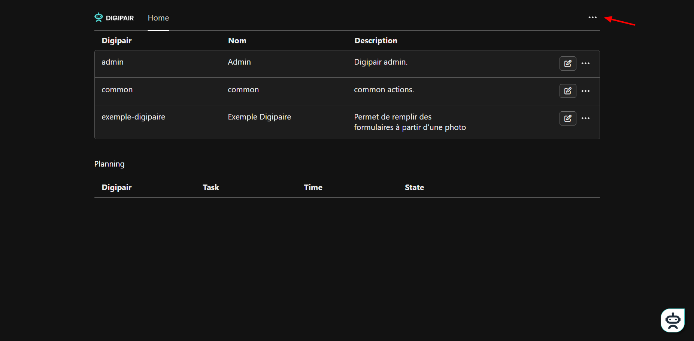

2. **Name and Specify the Purpose**
   - The chatbot will appear and ask you to name the Digipair and specify its purpose.
   - Respond to the chatbot by naming the Digipair `example` and specifying that it will be used to automatically fill out a form from an image.

## 2. Program for the Boost

Follow these steps to write the Boost program:

1. **Add Execution Properties**
   - In the "trigger list" reasoning, add an `execution` property using the reasoning settings button.

   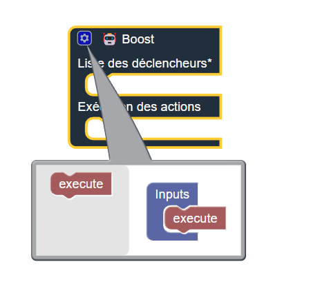

2. **Add a Trigger Component**

   - In the "communication with the chatbot" section, add a trigger component.

   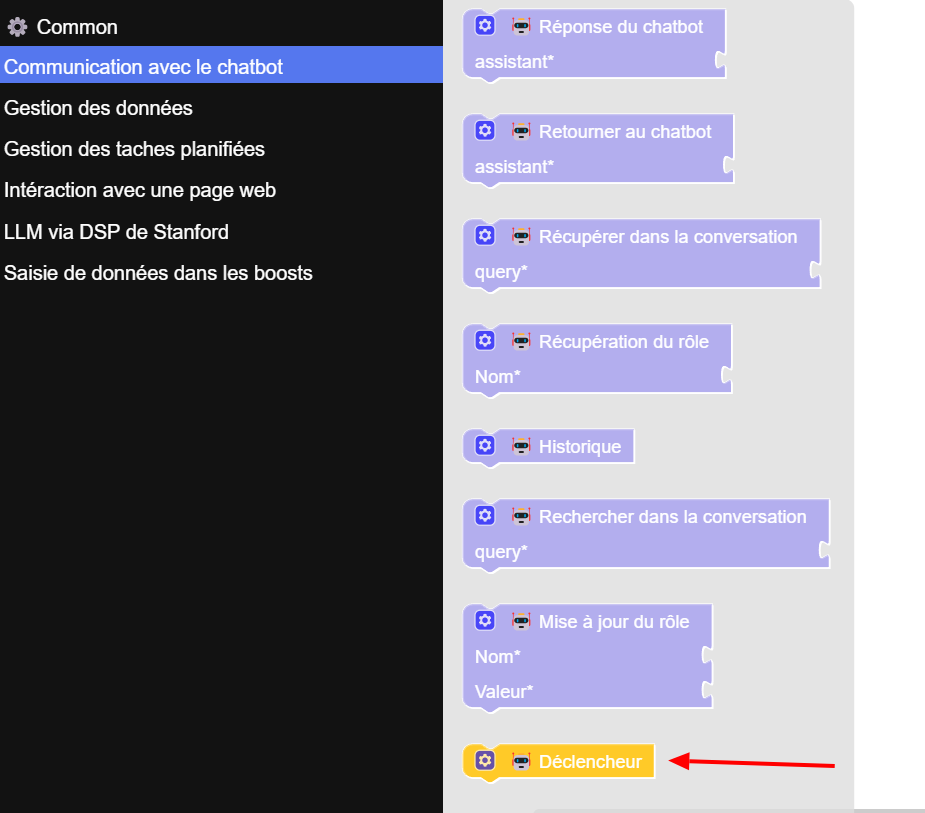

   - Add the following properties:
     - `name`
     - `prompt`
     - `text`
     - `selector`
     - `input`

   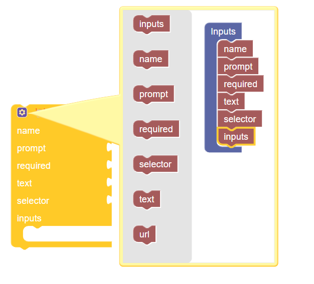

   - Name this component "fill the form from an image" using a `text` component from the "Common" section.
   - Set `prompt` and `required` to `false` using the `false` components from the "Common" section. Set `selector` to `html`.

   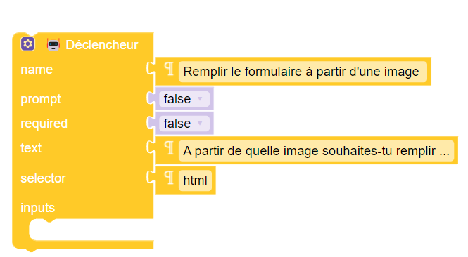

3. **Add the "Read a Binary File" Data**

   - In the "data input in boosts" section, add the "read a binary file" data.
   - Add the following properties:
     - `accept`
     - `required`

   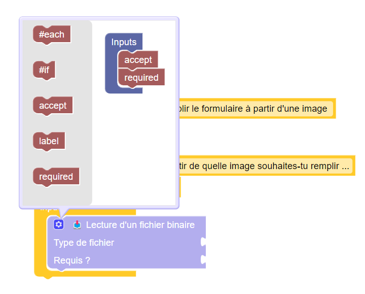

   - Set `file type` to `image/jpg` and `required?` to `true`.

   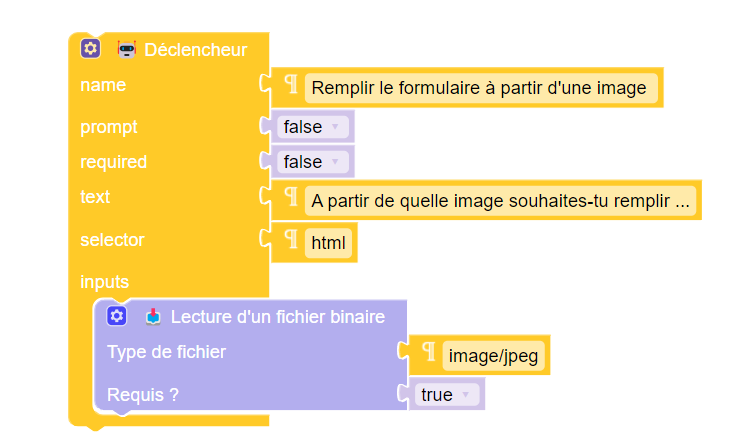

4. **Add the DSP Agent**

   - In the "LLM via Stanford DSP" section, add a DSP agent.
   - Add the `input` property.

   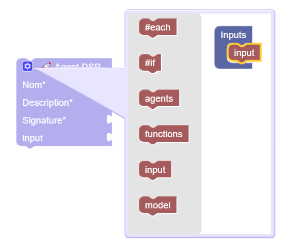

   - Name the DSP agent `Digiform` and add the description: "Useful assistant that extracts information from an image to fill out a form and its response for the user."
   - Set the following signature:
     ```
     document:image ->
     name:string,
     firstName:string,
     age:number,
     comment:string,
     assistant:string
     ```

   

   - In "data to process," add the following items:
     - `{}` 
     - `document:`
     - `{}` with `mimeType:` (text: `image/jpeg`) and `data:` (text: `EVALUATE:replace(request.body.inputs[1].value, "data:image/jpeg;base64,", "")`).

   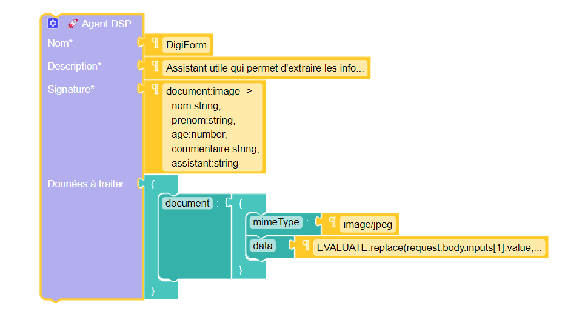

5. **Add the Chatbot Response**

   - In the "communication with the chatbot" section, add the "chatbot response" component.
   - Add the `command` property and place a `text` component in `assistant` with the value `{{previous.assistant}}`.

   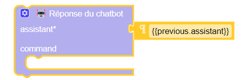

6. **Modify Attributes**

   - Add the "modify an attribute" pins from the "interact with a web page" section four times.
   - Fill in as follows:
     - `CSS Selector of the element*`: `#name`, `#firstName`, `#age`, `#comment`
     - `Attribute*`: `value`
     - `Value*`: `{{previous.name}}`, `{{previous.firstName}}`, `{{previous.age}}`, `{{previous.comment}}`

   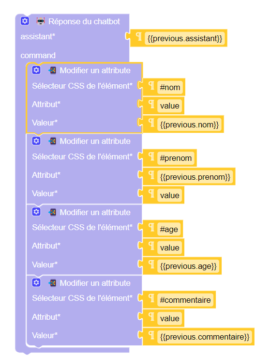

### Your program should look like this

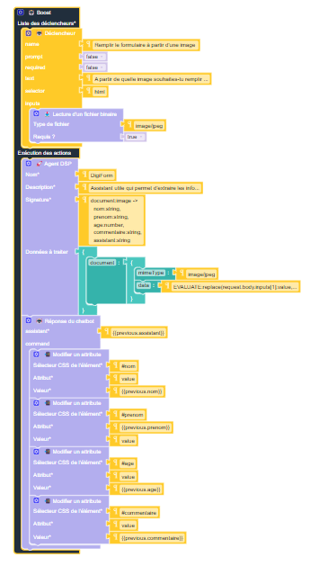

## 3. Creating a Page with the Form

Create an HTML page containing the form with the following code:

```html
<!doctype html>
<html lang="en">
  <head>
    <meta charset="UTF-8" />
    <meta name="viewport" content="width=device-width, initial-scale=1.0" />
    <title>Form</title>
    <link
      href="https://stackpath.bootstrapcdn.com/bootstrap/4.5.2/css/bootstrap.min.css"
      rel="stylesheet"
    />
  </head>
  <body>
    <div class="container">
      <h1 class="mt-5">Registration Form</h1>
      <form>
        <div class="form-group">
          <label for="name">Name</label>
          <input type="text" class="form-control" id="name" placeholder="Enter your name" />
        </div>
        <div class="form-group">
          <label for="firstName">First Name</label>
          <input type="text" class="form-control" id="firstName" placeholder="Enter your first name" />
        </div>
        <div class="form-group">
          <label for="age">Age</label>
          <input type="number" class="form-control" id="age" placeholder="Enter your age" />
        </div>
        <div class="form-group">
          <label for="comment">Comment</label>
          <textarea
            class="form-control"
            id="comment"
            rows="3"
            placeholder="Enter your comment"
          ></textarea>
        </div>
        <button type="submit" class="btn btn-primary">Submit</button>
      </form>
    </div>
  </body>
</html>
```

## 4. Integrating the Chatbot on the Web Page

To integrate the chatbot on the form web page, add the following code just after `</script>` in the page program:

```html
<script
  type="module"
  src="https://cdn.jsdelivr.net/npm/@digipair/skill-web-chatbot@latest/index.esm.js"
></script>
<digipair-chatbot apiurl="http://localhost:8080" code="example-digipair"></digipair-chatbot>
```

## 5. Testing the Digipair

With the created Digipair, you can fill out the form using an image.

1. **Test the Form**
   - Go to the form page.
   - Click on the "fill the form from an image" button next to the chatbot.
   - The chatbot will ask you to choose an image.
   - Once the image is selected and after a short wait, the form will be filled with the information extracted from the image.

## 6. Conclusion

You now have a Digipair configured to automatically fill out a form from an image. With this documentation, you can create and integrate Digipairs to automate your tasks and improve the efficiency of your processes.

**Digipair, simplify your daily operations with artificial intelligence!**