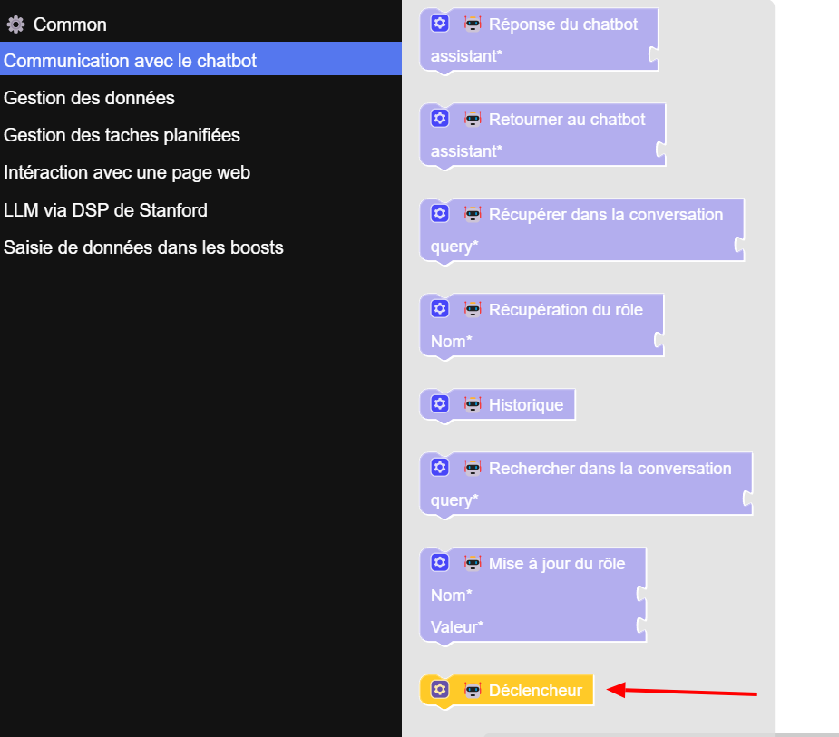
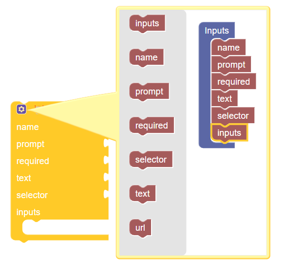
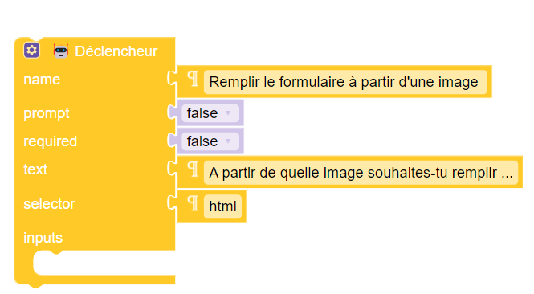
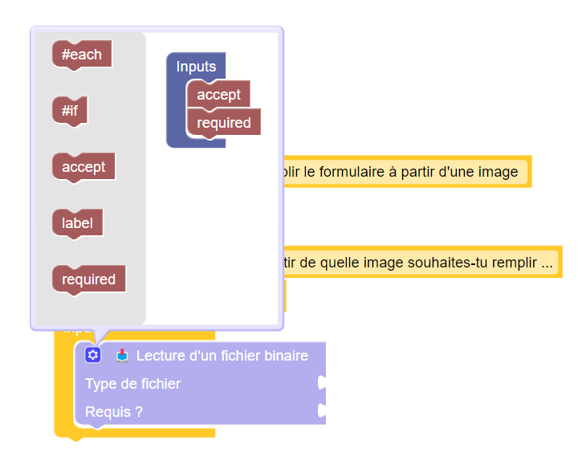
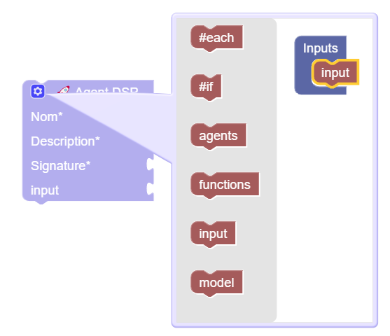
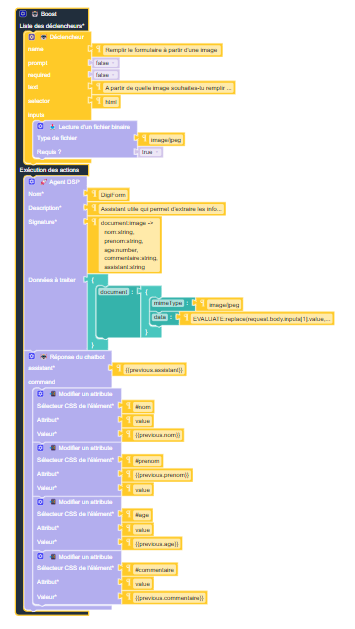

# Documentation Technique pour Digipair

## 1. Création d'un Digipair

Pour créer un Digipair, suivez les étapes ci-dessous :

1. **Accéder à la Factory**

   - Une fois sur la Factory, cliquez sur les trois petits points en haut de la page d'accueil.

   

2. **Nommer et spécifier l'utilité**
   - Le chatbot apparaîtra et vous demandera de nommer le Digipair ainsi que de spécifier son utilité.
   - Répondez au chatbot en nommant le Digipair `exemple` et en précisant qu'il va servir à remplir automatiquement un formulaire à partir d'une image.

## 2. Programme pour le Boost

Suivez ces étapes pour écrire le programme du Boost :

1. **Ajouter des propriétés d'exécution**
   - Dans le raisonnement "liste des déclencheurs", ajoutez une propriété `execution` en utilisant le bouton paramètres du raisonnement.


1. **Ajouter un composant déclencheur**

   - Dans la section "communication avec le chatbot", ajoutez un composant déclencheur.

   

   - Ajoutez les propriétés suivantes :
     - `name`
     - `prompt`
     - `text`
     - `selector`
     - `input`

   

   - Appelez ce composant "remplir le formulaire à partir d'une image" en utilisant un composant `text` de la section "Common".
   - Mettez `prompt` et `required` à `false` en utilisant les composants `false` de la section "Common". Et mettez `selector` à `html`

   

2. **Ajouter la donnés "lecture d'un fichier binaire"**

   - Dans la section "saisie de données dans les boosts", ajoutez la donnée"lecture d'un fichier binaire".
   - Ajoutez les propriétés suivantes :
     - `accept`
     - `required`

   

   - Mettez `type de fichier` à `image/jpg` et `requis?` à `true`.

   

3. **Ajouter l'agent DSP**

   - Dans la section "LLM via DSP de Stanford", ajoutez un agent DSP.
   - Ajoutez la propriété `input`.

   

   - Appelez l'agent DSP `Digiform` et ajoutez la description : "Assistant utile qui permet d'extraire les informations d'une image pour remplir un formulaire et sa réponse pour l'utilisateur".
   - Mettez la signature suivante :
     ```
     document:image ->
     nom:string,
     prenom:string,
     age:number,
     commentaire:string,
     assistant:string
     ```

   

   - Dans "données à traiter", ajoutez les éléments suivants :
     - `{}`
     - `document:`
     - `{}` avec `mimeType:` (texte : `image/jpeg`) et `data:` (texte : `EVALUATE:replace(request.body.inputs[1].value, "data:image/jpeg;base64,", "")`).

   

4. **Ajouter la réponse du chatbot**

   - Dans la section "communication avec le chatbot", ajoutez le composant "réponse du chatbot".
   - Ajoutez la propriété `command` et mettez un composant `text` dans `assistant` avec la valeur `{{previous.assistant}}`.

   

5. **Modifier les attributs**

   - Ajoutez quatre fois le pins "modifier un attribute" de la section "interaction avec une page Web".
   - Remplissez comme suit :
     - `Sélecteur CSS de l'élément*` : `#nom`, `#prenom`, `#age`, `#commentaire`
     - `Attribut*` : `value`
     - `Valeur*` : `{{previous.nom}}`, `{{previous.prenom}}`, `{{previous.age}}`, `{{previous.commentaire}}`

   

### votre programme doit ressembler à ça



## 3. Création d'une Page avec le Formulaire

Créez une page HTML contenant le formulaire avec le code suivant :

```html
<!doctype html>
<html lang="fr">
  <head>
    <meta charset="UTF-8" />
    <meta name="viewport" content="width=device-width, initial-scale=1.0" />
    <title>Formulaire</title>
    <link
      href="https://stackpath.bootstrapcdn.com/bootstrap/4.5.2/css/bootstrap.min.css"
      rel="stylesheet"
    />
  </head>
  <body>
    <div class="container">
      <h1 class="mt-5">Formulaire d'inscription</h1>
      <form>
        <div class="form-group">
          <label for="nom">Nom</label>
          <input type="text" class="form-control" id="nom" placeholder="Entrez votre nom" />
        </div>
        <div class="form-group">
          <label for="prenom">Prénom</label>
          <input type="text" class="form-control" id="prenom" placeholder="Entrez votre prénom" />
        </div>
        <div class="form-group">
          <label for="age">Âge</label>
          <input type="number" class="form-control" id="age" placeholder="Entrez votre âge" />
        </div>
        <div class="form-group">
          <label for="commentaire">Commentaire</label>
          <textarea
            class="form-control"
            id="commentaire"
            rows="3"
            placeholder="Entrez votre commentaire"
          ></textarea>
        </div>
        <button type="submit" class="btn btn-primary">Envoyer</button>
      </form>
    </div>
  </body>
</html>
```

## 4. Intégration du Chatbot sur la Page Web

Pour intégrer le chatbot sur la page web du formulaire, ajoutez le code suivant juste après `</script>` dans le programme de la page :

```html
<script
  type="module"
  src="https://cdn.jsdelivr.net/npm/@digipair/skill-web-chatbot@latest/index.esm.js"
></script>
<digipair-chatbot apiurl="http://localhost:8080" code="exemple-digipaire"></digipair-chatbot>
```

## 5. Test du Digipair

Avec le Digipair créé, vous pouvez remplir le formulaire grâce à une image.

1. **Tester le formulaire**
   - Rendez-vous sur la page du formulaire.
   - Cliquez sur le bouton "remplir le formulaire à partir d'une image" qui se trouve à côté du chatbot.
   - Le chatbot vous demandera de choisir une image.
   - Une fois l'image choisie et après un court temps d'attente, le formulaire sera rempli avec les informations extraites de l'image.

## 6. Conclusion

Vous avez maintenant un Digipair configuré pour remplir automatiquement un formulaire à partir d'une image. Grâce à cette documentation, vous pouvez créer et intégrer des Digipairs pour automatiser vos tâches et améliorer l'efficacité de vos processus.

**Digipair, simplifiez vos opérations quotidiennes grâce à l'intelligence artificielle !**
